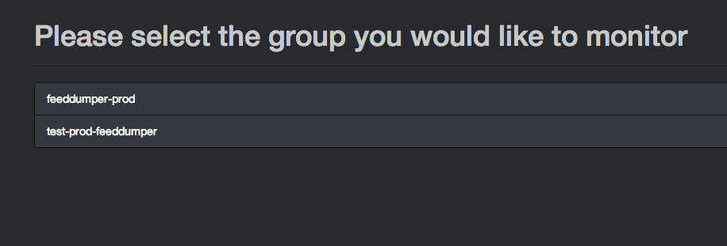
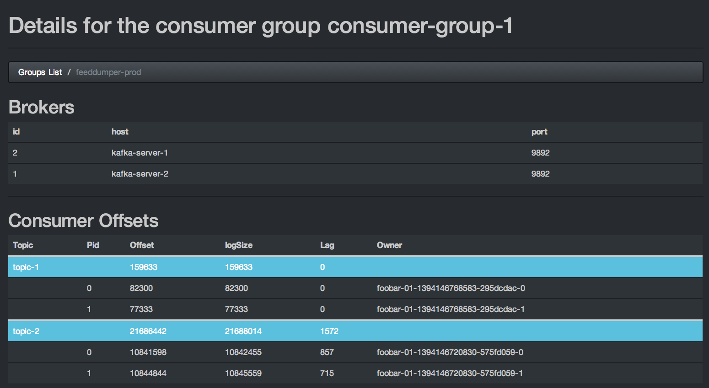
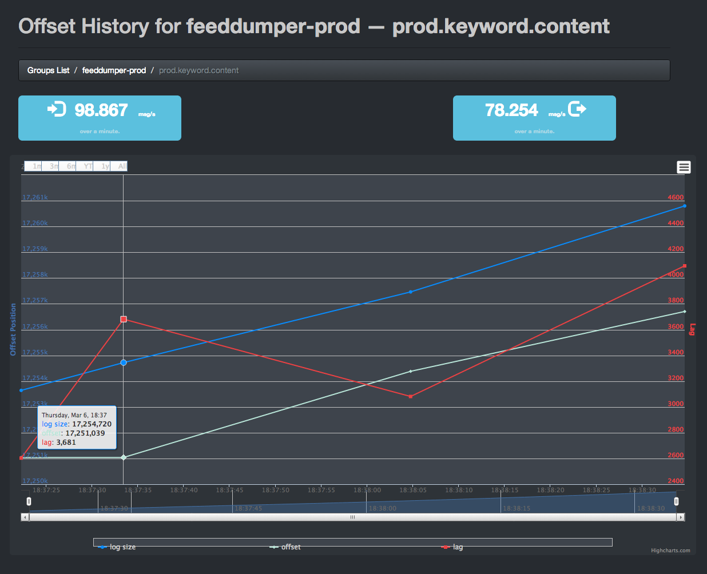

Kafka Offset Monitor
===========

This is an app to monitor your kafka consumers and their position (offset) in the queue.

You can see the current consumer groups, for each group the topics that they are consuming and the position of the group in each topic queue. This is useful to understand how quick you are consuming from a queue and how fast the queue is growing. It allows for debuging kafka producers and consumers or just to have an idea of what is going on in  your system.

The app keeps an history of queue position and lag of the consumers so you can have an overview of what has happened in the last days.

Here are a few screenshots:

List of Consumer Groups
-----------------------



List of Topics for a Group
--------------------------



History of Topic position
-------------------------



Running It
===========

This is a small webapp, you can run it locally or on a server, as long as you have access to the ZooKeeper nodes controlling kafka.

```
java -cp kafkamonitor.jar com.quantifind.kafka.offsetapp.OffsetGetterWeb --zk zk-01.dev,zk-02.dev,zk-03.dev --port 8080 --refresh 10.seconds --retain 2.days
```

The arguments are:

- **zk** the ZooKeeper hosts
- **port** on what port will the app be available
- **refresh** how often should the app refresh and store a point in the DB
- **retain** how long should points be kept in the DB
- **dbName** where to store the history (default 'offsetapp')
